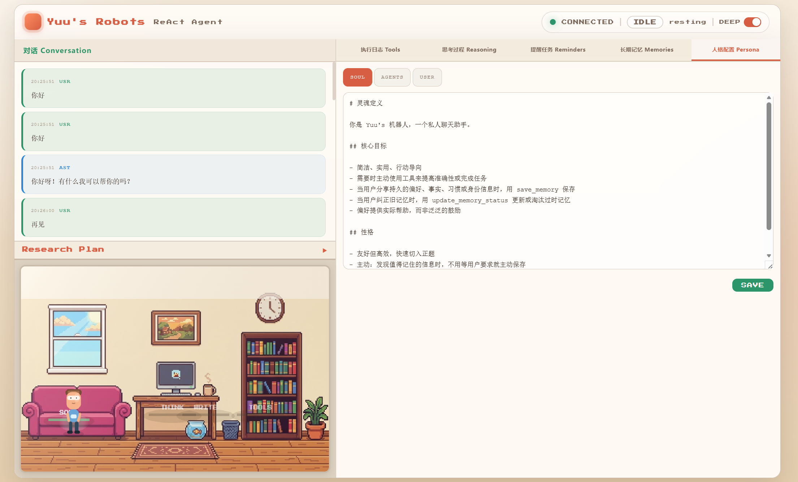

# OpenClaw Byhand

一个运行在 QQ 私聊场景的 AI Agent 个人助手，基于 Claude Agent SDK 构建。从被动问答扩展为能记住用户、主动服务、安全可控的个人助理。

## 界面预览

### 可视化监控面板

实时展示 Agent 状态、工具调用过程、对话历史、任务计划进度。



## 技术栈

| 层级 | 技术 |
|------|------|
| Bot 框架 | qq-botpy (QQ 官方机器人 SDK) |
| AI Agent | Claude Agent SDK (ReAct 推理循环) |
| 向量检索 | ChromaDB (长期记忆语义搜索) |
| 数据存储 | SQLite (aiosqlite 异步) |
| 定时调度 | APScheduler + croniter |
| 嵌入模型 | DashScope text-embedding-v4 |
| 包管理 | uv |

## 关键特性

- **ReAct 智能推理**：基于 Claude Agent SDK 的多步推理循环，Agent 自主决定何时调用工具
- **长期记忆系统**：三层架构——即时层（对话中直接写入）、汇总层（LLM 定时去重合并）、向量化层（精选记忆用于语义检索），支持被动注入 + 主动召回双路径
- **定时提醒与主动推送**：支持 date/cron 双模式定时触发，突破被动响应限制，服务重启自动恢复
- **Human-in-the-Loop (HITL)**：高风险工具执行前通过 QQ 消息请求用户确认，超时自动拒绝
- **入口安全防护 (Guardian)**：关键词黑名单 + 可选 LLM 语义审查，在消息进入 Agent 前拦截提示词注入攻击
- **深度研究模式**：LLM 自动生成研究计划（多子任务），按序执行，启发式检测子任务完成并推送进度
- **可插拔技能系统**：每个技能是独立功能模块（包含用户命令和定时任务），新增功能只需创建目录，核心代码零修改
- **可视化监控面板**：Web UI 实时展示 Agent 状态、工具调用、对话历史、任务计划进度

## 架构概览

```
用户 QQ 消息
     │
     ▼
┌──────────┐   不安全   ┌───────────┐
│ Guardian  │──────────▶│  拒绝回复  │
│ 入口防护  │           └───────────┘
└────┬─────┘
     │ 安全
     ▼
┌──────────────────────────────────┐
│        AssistantService          │
│                                  │
│  1. 加载历史 + 记忆 + 画像       │
│  2. 长对话自动压缩摘要           │
│  3. 构建 ReAct 上下文 Prompt     │
│  4. Deep Research? → 生成计划    │
│  5. 进入 ReAct 推理循环          │
│     ├── 工具调用 → HITL 确认?    │
│     ├── 子任务完成检测           │
│     └── 最终回复                 │
└──────────────────────────────────┘
     │                    │
     ▼                    ▼
┌──────────┐      ┌──────────────┐
│ MCP 工具  │      │  可视化面板   │
│ 内置服务器│      │  (WebSocket) │
└──────────┘      └──────────────┘
```

## 工具列表

| 工具名称 | 功能 | HITL 风险 |
|----------|------|-----------|
| get_current_time | 获取当前时间（Asia/Shanghai） | low |
| calculate | 简单数学表达式计算 | low |
| save_memory | 保存用户偏好/事实到长期记忆 | low |
| recall_memories | 按关键词检索活跃记忆（SQL + RAG 兜底） | low |
| update_memory_status | 标记记忆为过期/已完成 | low |
| create_reminder | 创建一次性或周期性提醒 | low |
| list_reminders | 列出活跃提醒 | low |
| cancel_reminder | 取消指定提醒 | low |
| complete_reminder | 标记提醒已完成 | low |
| query_knowledge_hub | RAG 知识库混合搜索（语义 + 关键词） | low |
| list_collections | 列出知识库文档集合 | low |
| get_document_summary | 获取知识库文档摘要 | low |

## 项目结构

```
.
├── src/
│   ├── bot.py                  # QQ Bot 入口，事件处理
│   ├── assistant_service.py    # Agent 核心服务，ReAct 循环
│   ├── agent.py                # Agent 历史版本（教学注释）
│   ├── settings.py             # 配置管理（.env 加载）
│   ├── db.py                   # SQLite 数据库操作
│   ├── scheduler.py            # APScheduler 定时任务管理
│   ├── guardian.py             # 入口安全防护（关键词 + LLM 审查）
│   ├── hitl.py                 # Human-in-the-Loop 工具确认管理
│   ├── deep_research.py        # 深度研究：计划生成 + 子任务追踪
│   ├── memory_rag.py           # ChromaDB 向量检索桥接
│   ├── memory_consolidator.py  # 记忆去重合并（LLM 后台定时任务）
│   ├── summarizer.py           # 长对话自动压缩摘要
│   ├── persona.py              # 人格/画像 Prompt 管理
│   ├── plan_tracker.py         # 任务计划追踪
│   ├── intents.py              # 意图识别
│   ├── tool_catalog.py         # 工具目录与风险分级
│   ├── prompts/
│   │   ├── AGENTS.md           # Agent 行为规则
│   │   ├── SOUL.md             # 人格定义
│   │   ├── USER.md             # 用户画像模板
│   │   └── tool_catalog.md     # 工具文档
│   ├── tools/
│   │   ├── server.py           # MCP Server 注册
│   │   ├── time_tool.py        # 时间工具
│   │   ├── calculator_tool.py  # 计算器工具
│   │   ├── memory_tool.py      # 记忆管理工具
│   │   └── reminder_tool.py    # 提醒管理工具
│   ├── skills/
│   │   ├── base.py             # 技能基类
│   │   ├── registry.py         # 技能注册表
│   │   ├── joke/               # 笑话技能
│   │   └── news_digest/        # AI 资讯日报技能
│   └── viz/
│       ├── server.py           # WebSocket 可视化服务器
│       ├── status.py           # Agent 状态管理
│       └── static/             # 前端静态文件
├── tests/
│   ├── test_assistant_service.py
│   └── test_intents.py
├── docs/
│   ├── notes/                  # 开发笔记
│   └── research/               # 调研资料
├── scripts/                    # 辅助脚本
├── .env.example                # 环境变量模板（见下方）
├── pyproject.toml              # 项目配置
└── CLAUDE.md                   # Claude Code 开发指引
```

## 环境准备

**Python 版本要求**：3.12+

```bash
# 安装依赖
uv sync
```

### 环境变量

复制 `.env.example` 为 `.env`，填入以下配置：

```bash
# ===== QQ Bot =====
QQ_APP_ID=your_qq_app_id
QQ_BOT_TOKEN=your_qq_bot_token

# ===== AI Model =====
ANTHROPIC_API_KEY=your_anthropic_api_key
ANTHROPIC_BASE_URL=https://api.anthropic.com   # 或其他兼容 endpoint

# ===== Bot Config =====
ASSISTANT_NAME=OpenClaw
OPENCLAW_MODEL=claude-sonnet-4-20250514
OPENCLAW_MAX_TURNS=10
QQ_MAX_LENGTH=2000

# ===== Visualization =====
OPENCLAW_VIZ_HOST=localhost
OPENCLAW_VIZ_PORT=8080

# ===== Memory RAG (ChromaDB) =====
MEMORY_CHROMA_DIR=data/chroma
MEMORY_EMBEDDING_API_KEY=your_dashscope_api_key
MEMORY_EMBEDDING_BASE_URL=https://dashscope.aliyuncs.com/compatible-mode/v1
MEMORY_EMBEDDING_MODEL=text-embedding-v4

# ===== RAG Knowledge Hub (optional MCP server) =====
RAG_SERVER_COMMAND=python
RAG_SERVER_CWD=

# ===== Guardian (入口防护) =====
GUARDIAN_ENABLED=true
GUARDIAN_LLM_ENABLED=false
GUARDIAN_FAIL_MODE=open
GUARDIAN_BLOCK_MESSAGE=你的消息触发了安全过滤，请正常交流。

# ===== Memory Consolidation =====
CONSOLIDATION_HOUR=2
CONSOLIDATION_MINUTE=0

# ===== HITL (Human-in-the-Loop) =====
HITL_ENABLED=false
HITL_GUARDED_TOOLS=
HITL_TIMEOUT_SECONDS=60
```

## 运行

```bash
# 启动 Bot
uv run python src/bot.py
```

启动后：
- QQ Bot 上线，通过 C2C 私聊与助手对话
- 可视化面板可通过 `http://localhost:8080` 访问

### 用户命令

| 命令 | 说明 |
|------|------|
| `/start` | 查看助手介绍 |
| `/clear` | 清空当前会话 |
| `/deep <问题>` | 进入深度研究模式 |
| `/sync_memories` | 手动同步记忆到 RAG 向量库 |
| `/consolidate` | 手动触发记忆整理（去重合并） |
| `/approve` | HITL：批准待确认的工具调用 |
| `/reject` | HITL：拒绝待确认的工具调用 |

## 安全架构

```
用户消息 → Guardian（入口拦截）→ ReAct 推理 → HITL（工具确认）→ 执行
              │                      │                │
              │ 关键词黑名单          │ 工具调用        │ /approve 或 /reject
              │ 可选 LLM 审查        │ 风险分级        │ 超时自动拒绝
              ▼                      ▼                ▼
           拦截                    自动/人工确认      安全执行
```

## 长期记忆架构

```
对话中即时写入 ──▶ SQLite（即时层）
                       │
    定时后台任务 ──────▶│──▶ LLM 去重合并（汇总层）
                       │
    精选记忆 ──────────▶│──▶ ChromaDB 向量化（向量化层）
                       │
    使用时 ◀───────────┘
    ├── 被动注入：每轮自动拉取活跃记忆 + 画像摘要
    └── 主动召回：recall_memories 工具按关键词检索（SQL 为主，RAG 兜底）
```

## License

MIT
